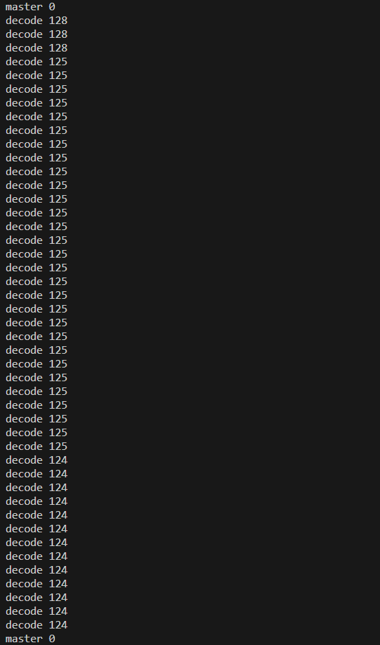

# PyQt Visualization for FPGA accelarating touch sensor Array  
### Run with Hardware
ensure your port specified in `plot_3dimage.py` is aligned with your actualy port,
```
python -m scripts.plot_3d
```
### Run with virtual sine wave input 
The scripts can be run directly.
```
python -m scripts.te
```
#### Platform
- windows 11
- PyQt 5
- python 3.8
### 首次窗口融进去的demo
```
python -m scripts.te_02
```
#### examples official examples from local machine
- python F:\Anoconda_python\installation\Lib\site-packages\pyqtgraph\examples\GLGradientLegendItem.py 

### usb接收频率和上位机画图的频率的比值大概是
