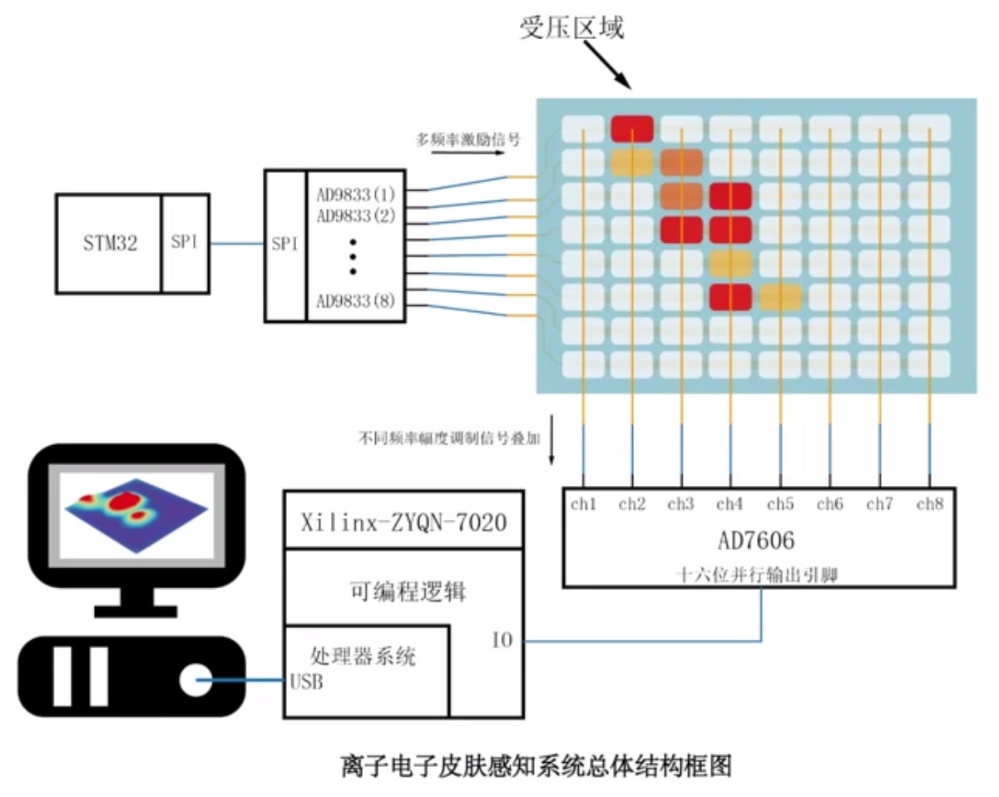

# PyQt Visualization for FPGA accelarating touch sensor Array on Master Machine 
---

### 3D reconstruction visualization g

<div style="text-align: center;">
	
</div>

<div style="text-align: center;">
	
</div>

<div style="text-align: center;">
	
</div>


### Hardware Design
<div style="text-align: center;">
	
</div>


### Run with Hardware
ensure your port specified in `plot_3dimage.py` is aligned with your actualy port,
```
python3 -m scripts.test_03
```

### Run with virtual sine wave input 
The scripts can be run directly to helping debug.
```
python -m scripts.te
```
#### Platform
- test on ubuntu22 or windows 11
- PyQt 5
- python 3.8


